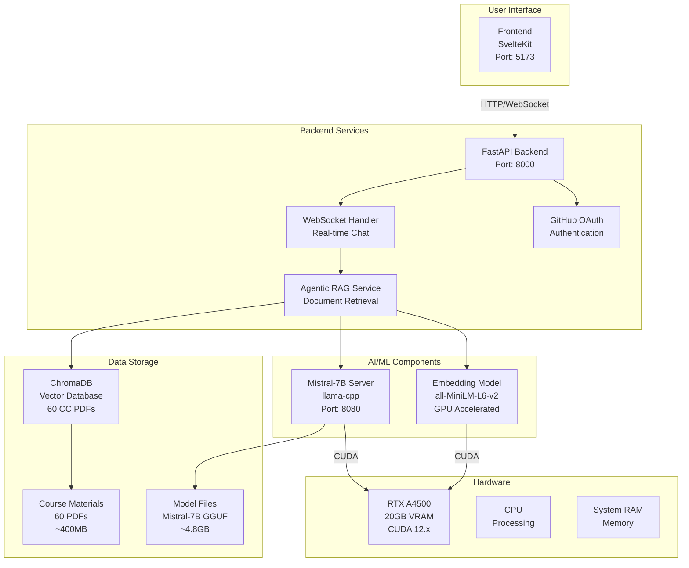
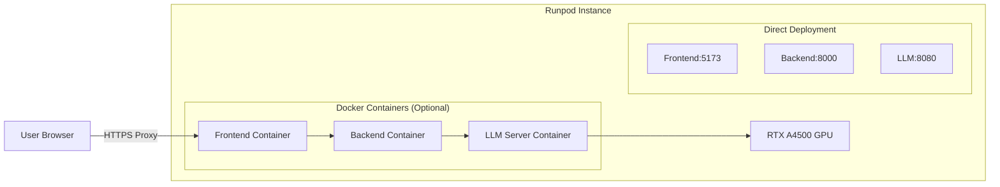

# AI Mentor System Architecture

## Overview

The AI Mentor system consists of several interconnected components working together to provide an intelligent tutoring experience for computer science education.

## System Components

## Data Flow

1. **User Query** → Frontend (SvelteKit)
2. **WebSocket Connection** → Backend API
3. **Query Processing** → Agentic RAG Service
4. **Document Retrieval** → ChromaDB (Vector Search)
5. **Context Generation** → Embedding Model (GPU)
6. **Response Generation** → Mistral-7B (GPU)
7. **Streaming Response** → Frontend via WebSocket

## Key Technologies

### Frontend
- **Framework**: SvelteKit
- **Language**: TypeScript
- **Styling**: Tailwind CSS
- **Real-time**: WebSocket

### Backend
- **API**: FastAPI
- **Language**: Python 3.12+
- **Async**: asyncio
- **Authentication**: GitHub OAuth

### AI/ML
- **LLM**: Mistral-7B-Instruct-v0.2 (GGUF format)
- **Embeddings**: all-MiniLM-L6-v2 (sentence-transformers)
- **Vector DB**: ChromaDB
- **GPU Acceleration**: CUDA 12.x

### Infrastructure
- **GPU**: NVIDIA RTX A4500 (20GB VRAM)
- **Deployment**: Runpod Cloud
- **Container**: Docker (optional)

## Memory Usage

### GPU Memory Allocation
- **Mistral-7B**: ~5.9GB (full offload)
- **Embeddings**: ~0.5GB
- **Total GPU Usage**: ~6.5GB
- **Available**: ~13.5GB

### System Memory
- **ChromaDB**: ~200-300MB (60 PDFs)
- **Python Environment**: ~2GB
- **OS & Services**: ~4GB

## Performance Characteristics

### Inference Speed
- **Mistral-7B**: 30-50 tokens/second
- **Embeddings**: 300 batches/second
- **Response Time**: 2-5 seconds for typical query

### Ingestion Speed
- **Processing**: 250-300 chunks/second
- **Total Time**: 3-5 minutes for 60 PDFs
- **Chunks Created**: ~20,000-30,000

## Security Considerations

1. **API Security**: CORS configured for Runpod proxy URLs
2. **Authentication**: GitHub OAuth integration
3. **Data Privacy**: No user data stored permanently
4. **Network**: All services run on localhost/internal

## Scaling Considerations

### Current Limitations
- Single GPU instance
- No horizontal scaling
- Local ChromaDB instance

### Potential Improvements
1. **Multi-GPU Support**: For larger models
2. **Distributed Vector DB**: ChromaDB cluster
3. **Load Balancing**: Multiple backend instances
4. **Caching**: Redis for frequent queries

## Monitoring & Debugging

### Key Metrics
- GPU utilization and memory
- API response times
- WebSocket connection status
- Ingestion progress

### Debugging Tools
- nvidia-smi for GPU monitoring
- Application logs
- WebSocket connection testing
- RAG evaluation framework

## Deployment Architecture

This architecture provides a robust, scalable foundation for the AI Mentor system with excellent performance characteristics on the RTX A4500 GPU.